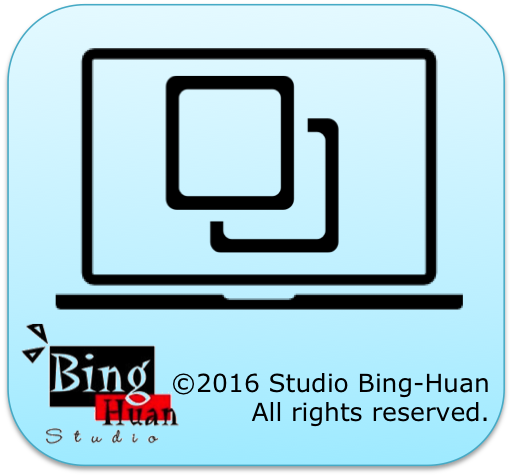
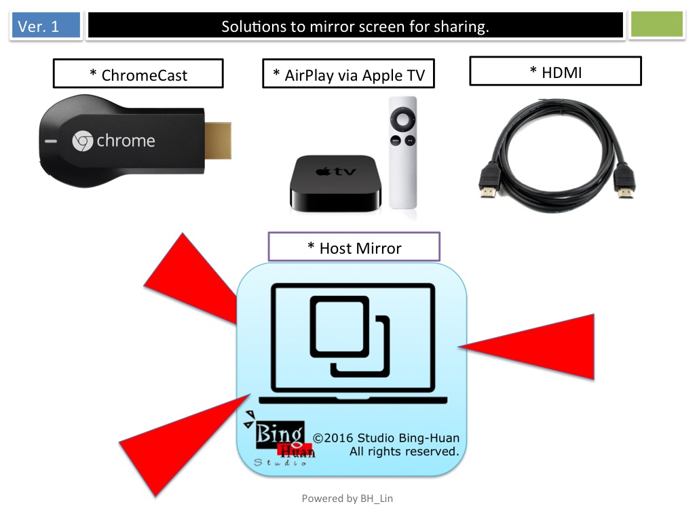
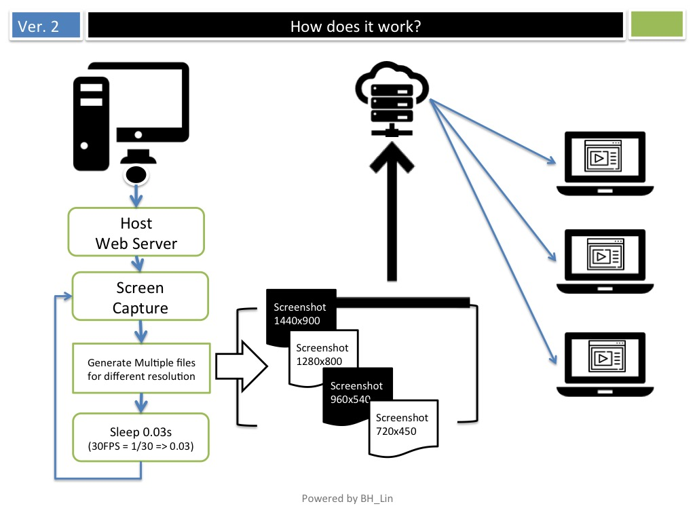
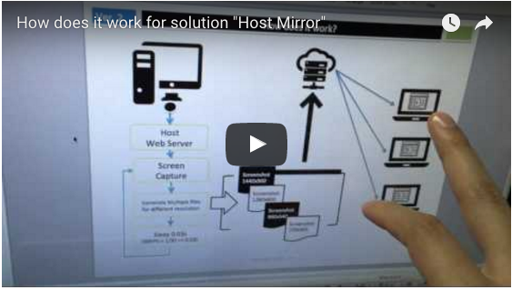

<h1>Project: Host Mirror</h1>

Mirror your desktop screen to web page and share it.

<a href="http://studiobinghuan.blogspot.tw/2016/04/host-mirror.html?view=flipcard">http://studiobinghuan.blogspot.tw/2016/04/host-mirror.html?view=flipcard</a> 

<h3>How to use</h3>
./hostmirror

<h3>Use Case</h3>
If there is no HDMI or VGA cable line for video output.  
Or there is no Chrome Cast or Apple TV for "Screen Cast". 
You can use this to share screen. 

<h3>Here is the demo</h3>

